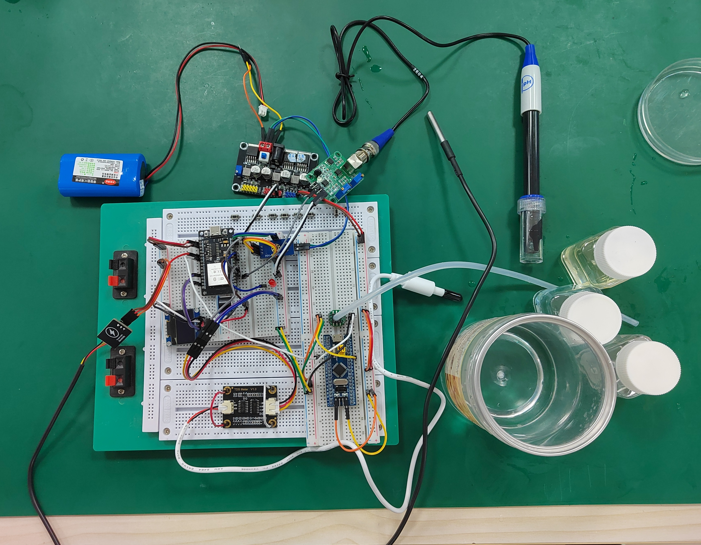

# ESP32 IoT 智能水情监测系统

## 📋 项目简介

本项目基于 **ESP-WROOM-32** 单片机、采用 **Arduino** 框架开发的智能水情监测物联网系统。系统集成水温、水位、水质、PH值及电池电压等多参数传感器，实现数据实时采集、智能报警与本地显示。在低功耗设计上进行了针对性优化，适用于长期无人值守场景。

通过内置 Web 服务器，用户可远程查看实时数据、回溯最近 100 条历史记录，并在线调整各监测项的报警阈值。阈值修改接口具备输入校验与防错提示机制，确保设定值始终处于合理区间，避免因误操作导致报警策略失效。

系统适用于鱼缸监测、水产养殖、水文观测等需要远程水质监控的应用场景。

## ✨ 功能特性

- 🌡️ **水温监测**：DS18B20 数字温度传感器，精度 ±0.5℃，实时采集温度数据
- 💧 **水位监测**：模拟式水位传感器，连续检测液位变化
- 🧪 **水质监测**：TDS 传感器，实时评估水体纯净度（ppm）
- 🧫 **PH 值监测**：PH 传感器，实时检测水体酸碱度
- 🔋 **电池电压监测**：实时监测供电电压，掌握设备电量状态
- 🖥️ **本地显示**：0.96 寸 OLED 屏幕，现场查看实时监测数据
- 🌐 **远程访问**：内置 Web 服务器，支持浏览器实时查看与操作
- 📊 **历史记录**：支持回溯最近 100 条监测数据，便于趋势分析
- ⚙️ **阈值在线调整**：支持远程修改报警阈值，带输入校验与防错提示
- 🔔 **智能报警**：超阈值触发蜂鸣器 + LED 声光报警，及时响应异常
- 📱 **响应式界面**：Web 面板自适应 PC、平板与手机端访问
- 🔋 **低功耗设计**：针对长期无人值守场景进行功耗优化，延长续航

## 🛠️ 硬件平台

| 组件 | 型号 | 说明 |
|------|------|------|
| 主控芯片 | ESP-WROOM-32 | 双核 Xtensa LX6，WiFi + BLE，低功耗模式支持 |
| 开发框架 | Arduino | 易于开发的嵌入式框架 |
| 温度传感器 | DS18B20 | 一线式数字温度传感器，精度 ±0.5℃ |
| 水位传感器 | 模拟量输出 | 检测液面高度变化 |
| TDS 传感器 | 电导率模块 | 测量水中溶解性固体总量（ppm） |
| PH 传感器 | PH 电极模块 | 检测水体酸碱度 |
| 电池 | 锂电池 / 干电池组 | 为系统供电，支持低功耗运行 |
| 电源管理 | 降压/稳压模块 | 为 ESP32 及传感器提供稳定电压 |
| OLED 显示屏 | 0.96 寸 I2C | 128×64 分辨率，本地数据展示 |
| 蜂鸣器 | 5V 有源 | 声音报警输出 |
| 指示灯 | 5mm LED | 光信号报警 |

**水位测量设计备注**：本系统使用水压传感器间接测水位。因 ESP32 ADC 对低于 1V 的模拟信号分辨能力有限，为提升浅水区测量精度，系统额外采用 STM32 进行高精度信号采集，并通过串口将数据转发至 ESP32。用户亦可通过选用带放大的传感器或增加安装水深来优化此环节。

## 🚀 快速开始

### 1. 克隆仓库

git clone https://github.com/Chenpengrong/esp32-iot-water-monitor.git
cd esp32-iot-water-monitor

### 2. 开发环境准备

本项目使用 PlatformIO 作为开发平台，推荐以下两种方式：

方式一：VS Code + PlatformIO 插件（推荐）

1. 安装 Visual Studio Code
2. 在 VS Code 扩展商店中搜索并安装 PlatformIO IDE 插件
3. 重启 VS Code，等待 PlatformIO 初始化完成
4. 用 VS Code 打开项目文件夹，PlatformIO 会自动识别并加载 platformio.ini 配置

方式二：PlatformIO CLI（命令行）

安装 PlatformIO（需 Python 环境）：
pip install platformio

验证安装：
pio --version

### 3. 安装依赖库

PlatformIO 会根据 platformio.ini 自动下载所需库，无需手动安装。

在项目根目录执行：
pio lib install

本项目实际使用的依赖库：
- OneWire：DS18B20 通信协议
- DallasTemperature：DS18B20 温度传感器驱动
- U8g2：OLED 显示屏驱动（0.96 寸 I2C）
- ESP32AnalogRead：ESP32 ADC 增强读取库
- Adafruit BusIO：Adafruit 传感器 I2C/SPI 通信底层库

其他所需库（如 ESPAsyncWebServer）已包含在项目代码中，无需额外安装。

### 4. 编译项目

pio run

首次编译时间较长，PlatformIO 会自动下载 ESP32 编译工具链和依赖库。

### 5. 烧录固件

pio run -t upload

执行前请确保 ESP32 已通过 USB 连接到电脑，并已正确安装 USB 驱动。

### 6. 串口监视（可选）

pio device monitor

默认波特率：115200，可在 platformio.ini 中修改 monitor_speed 参数。

### 7. 首次使用配置

烧录前，需要在代码中配置 WiFi 凭据：

1. 打开 `src/main.cpp`，找到以下代码段：
   const char* ssid = "你的WIFI名称";
   const char* password = "你的WIFI密码";

2. 将 "你的WIFI名称" 替换为实际 WiFi 名称，"你的WIFI密码" 替换为实际密码。
   可以是路由器 WiFi，也可以是手机开启的热点。

3. 保存文件并重新编译烧录。

烧录完成后，ESP32 会自动连接指定的 WiFi 网络。

查看设备 IP 地址：
- 方法一：打开串口监视器（pio device monitor），ESP32 连接成功后会打印分配到的 IP 地址
- 方法二：登录路由器/热点设备的管理后台，查看连接设备列表中的 ESP32

访问 Web 界面：
- 确保电脑或手机与 ESP32 连接在同一个 WiFi/热点下
- 在浏览器中输入串口打印的 IP 地址（例如 http://192.168.1.100 或 http://192.168.43.100）
- 即可查看实时监测数据、历史记录和报警阈值管理页面

### 快速命令速查

编译：pio run
烧录：pio run -t upload
串口监视：pio device monitor
清理编译文件：pio run -t clean
查看帮助：pio --help

### 常见问题

Q1: 烧录失败，提示 "Failed to connect to ESP32"
- 检查 USB 线是否支持数据传输（部分 USB 线仅支持充电）
- 按住 ESP32 上的 BOOT 按钮，再点击烧录，待提示连接成功后再松开
- 检查是否正确安装 CH340/CP210x 串口驱动

Q2: 编译时报错 "Library not found"
- 执行 pio lib install 重新安装依赖库
- 或删除 .pio 文件夹后重新编译：rm -rf .pio && pio run

Q3: 烧录后串口无输出
- 检查波特率是否设置为 115200
- 尝试按一下 ESP32 上的 EN/RST 复位按钮

Q4: Web 界面无法访问
- 确保设备已连接到 ESP32 的 WiFi 热点（或 ESP32 已接入局域网）
- 确认访问地址正确
- 检查串口输出，确认 ESP32 IP 地址

### 开发环境搭建示意图

电脑 --USB线-- ESP32 开发板
    │
    ├── 1. VS Code + PlatformIO 插件
    ├── 2. 打开项目文件夹（自动识别）
    ├── 3. 点击左下角 ✔（编译）→ 箭头（烧录）
    └── 4. 打开串口监视器查看输出

### 使用建议

- 首次编译耗时较长（需下载工具链和库），请耐心等待
- 推荐开发环境：VS Code + PlatformIO（比 Arduino IDE 更强大，支持代码补全和调试）
- 如使用 Arduino IDE，需手动安装依赖库和 ESP32 开发板支持包（不推荐，建议使用 PlatformIO）